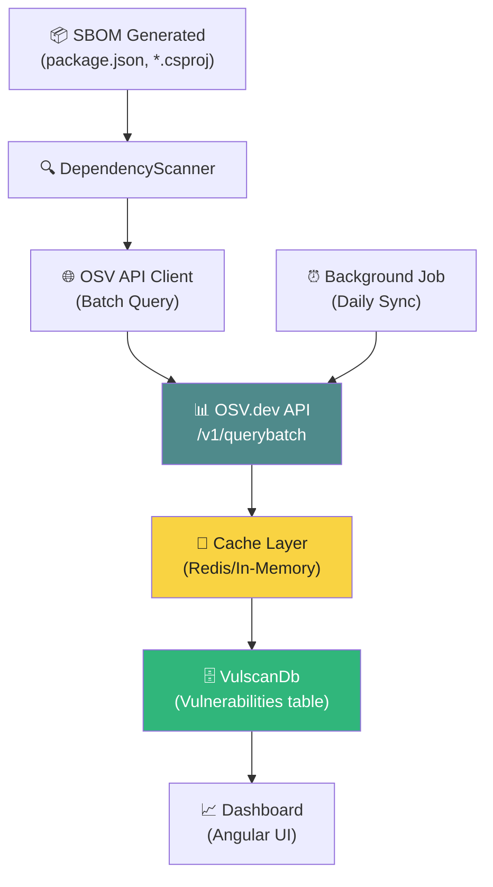
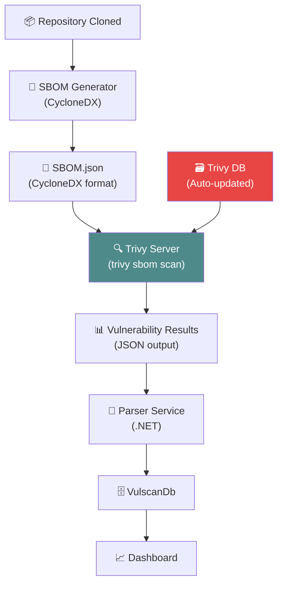

# 🔒 Enterprise CVE Integration Guide

This guide explains how to integrate **real-time CVE data sources** into Vulscan to achieve enterprise-grade vulnerability scanning capabilities.

---

## 📋 Table of Contents

1. [Current State](#current-state)
2. [CVE Data Sources](#cve-data-sources)
3. [Recommended Architecture](#recommended-architecture)
4. [Implementation Options](#implementation-options)
5. [Step-by-Step Integration](#step-by-step-integration)
6. [Best Practices](#best-practices)

---

## Current State

### 🔴 **Current Limitation**

Your `DependencyScanner.cs` uses a **hardcoded dictionary** of vulnerabilities:

```csharp
private static readonly Dictionary<string, List<KnownVulnerability>> KnownVulnerabilities = new()
{
    ["lodash"] = [new("CVE-2021-23337", "4.17.21", VulnerabilitySeverity.High, 7.2, ...)],
    // ... more hardcoded entries
};
```

**Problems:**
- ❌ No real-time updates
- ❌ Limited coverage (only ~15 packages)
- ❌ Manual maintenance required
- ❌ Misses new CVEs published daily
- ❌ Not suitable for enterprise production

---

## CVE Data Sources

### 1. **NVD (National Vulnerability Database)** 🇺🇸

**Provider:** NIST (National Institute of Standards and Technology)

**Best For:** Comprehensive CVE coverage, CVSS scoring, detailed metadata

**API Details:**
- **URL:** `https://services.nvd.nist.gov/rest/json/cves/2.0`
- **Rate Limit:** 5 requests/30 seconds (no API key) | 50 requests/30 seconds (with API key)
- **Free Tier:** Yes, with API key registration
- **Coverage:** 200,000+ CVEs dating back to 1999
- **Update Frequency:** Real-time (within hours of disclosure)

**Pros:**
✅ Official NIST database  
✅ CVSS v2/v3 scores  
✅ CPE (Common Platform Enumeration) matching  
✅ Detailed references and descriptions  
✅ Free with API key

**Cons:**
⚠️ Rate limiting (requires caching)  
⚠️ Complex CPE matching logic  
⚠️ Requires package-to-CPE mapping

**API Example:**
```bash
# Get CVE details
curl "https://services.nvd.nist.gov/rest/json/cves/2.0?cveId=CVE-2021-23337"

# Search by keyword
curl "https://services.nvd.nist.gov/rest/json/cves/2.0?keywordSearch=lodash"

# Get recent CVEs (last 7 days)
curl "https://services.nvd.nist.gov/rest/json/cves/2.0?lastModStartDate=2026-04-23T00:00:00.000&lastModEndDate=2026-04-30T00:00:00.000"
```

---

### 2. **OSV (Open Source Vulnerabilities)** 🌐

**Provider:** Google (Open Source Security Team)

**Best For:** Package ecosystem-native vulnerability data (npm, NuGet, PyPI, etc.)

**API Details:**
- **URL:** `https://api.osv.dev/v1/query`
- **Rate Limit:** None (generous free tier)
- **Free Tier:** Completely free
- **Coverage:** 30+ ecosystems, 100,000+ vulnerabilities
- **Update Frequency:** Real-time from multiple sources

**Pros:**
✅ **Ecosystem-aware** (directly queries by package@version)  
✅ No rate limiting  
✅ Simple REST API + batch queries  
✅ Aggregates from GitHub, NVD, distros, etc.  
✅ Active community maintenance  
✅ **Best for npm, NuGet, Maven, PyPI**

**Cons:**
⚠️ Less detailed than NVD for some CVEs  
⚠️ May have duplicate entries from different sources

**API Example:**
```bash
# Query by package (npm example)
curl -X POST "https://api.osv.dev/v1/query" \
  -H "Content-Type: application/json" \
  -d '{
    "package": {
      "name": "lodash",
      "ecosystem": "npm"
    },
    "version": "4.17.15"
  }'

# Batch query (up to 1000 packages)
curl -X POST "https://api.osv.dev/v1/querybatch" \
  -H "Content-Type: application/json" \
  -d '{
    "queries": [
      {"package": {"name": "lodash", "ecosystem": "npm"}, "version": "4.17.15"},
      {"package": {"name": "axios", "ecosystem": "npm"}, "version": "0.21.1"}
    ]
  }'
```

**Response Format:**
```json
{
  "vulns": [
    {
      "id": "GHSA-29mw-wpgm-hmr9",
      "summary": "Prototype Pollution in lodash",
      "details": "Versions of lodash prior to 4.17.21 are vulnerable...",
      "aliases": ["CVE-2021-23337"],
      "severity": [
        {
          "type": "CVSS_V3",
          "score": "CVSS:3.1/AV:N/AC:L/PR:N/UI:N/S:U/C:H/I:H/A:H"
        }
      ],
      "affected": [
        {
          "package": {"name": "lodash", "ecosystem": "npm"},
          "ranges": [{"type": "SEMVER", "events": [{"introduced": "0"}, {"fixed": "4.17.21"}]}]
        }
      ]
    }
  ]
}
```

---

### 3. **GitHub Advisory Database** 🐙

**Provider:** GitHub Security Lab

**Best For:** npm, NuGet, Maven, RubyGems - tight GitHub integration

**API Details:**
- **URL:** `https://api.github.com/graphql` (GraphQL API)
- **Rate Limit:** 5,000 points/hour (authenticated)
- **Free Tier:** Yes, requires GitHub token
- **Coverage:** Curated advisories for major ecosystems
- **Update Frequency:** Real-time

**Pros:**
✅ High-quality curated data  
✅ Native GitHub ecosystem integration  
✅ CVSS scores and severity ratings  
✅ Direct package-level queries  
✅ Dependabot uses this data

**Cons:**
⚠️ Requires GraphQL knowledge  
⚠️ Rate limited (needs token)  
⚠️ Smaller coverage than OSV/NVD

**GraphQL Query Example:**
```graphql
{
  securityVulnerabilities(first: 100, ecosystem: NPM, package: "lodash") {
    nodes {
      advisory {
        ghsaId
        summary
        description
        severity
        cvss {
          score
          vectorString
        }
        references {
          url
        }
      }
      package {
        name
        ecosystem
      }
      vulnerableVersionRange
      firstPatchedVersion {
        identifier
      }
    }
  }
}
```

---

### 4. **Trivy Database** 🔍

**Provider:** Aqua Security

**Best For:** Offline scanning, container images, OS packages

**Details:**
- Built-in comprehensive vulnerability database
- Auto-updates from multiple sources (NVD, OSV, distros)
- Can run as a server mode (`trivy server`)
- Supports air-gapped environments

---

### 5. **Grype Database** 🔬

**Provider:** Anchore

**Best For:** Similar to Trivy, excellent SBOM integration

**Details:**
- Uses its own curated vulnerability database
- Strong CycloneDX/SPDX SBOM support
- Can scan SBOMs directly

---

## Recommended Architecture

### 🎯 **Option 1: OSV Integration (RECOMMENDED)**

**Why OSV?**
- ✅ **Zero rate limits** — no throttling issues
- ✅ **Ecosystem-native** — directly matches package@version
- ✅ **Batch API** — scan 1000 packages in one request
- ✅ **Free forever** — no API key needed
- ✅ **Multiple sources** — aggregates NVD, GitHub, distros

**Architecture:**



---

### 🎯 **Option 2: Trivy/Grype Integration**

**Why Trivy?**
- ✅ **Comprehensive** — scans SBOM, repos, containers, filesystems
- ✅ **Offline capable** — no external API calls needed
- ✅ **Fast** — optimized for CI/CD pipelines
- ✅ **Industry standard** — widely adopted

**Architecture:**



---

## Implementation Options

### **Comparison Matrix**

| Feature | OSV API | NVD API | Trivy | Grype | GitHub Advisory |
|---------|---------|---------|-------|-------|-----------------|
| **Setup Complexity** | ⭐ Easy | ⭐⭐ Medium | ⭐⭐⭐ Hard | ⭐⭐⭐ Hard | ⭐⭐ Medium |
| **Rate Limits** | ✅ None | ⚠️ 50/30s | ✅ None | ✅ None | ⚠️ 5000/hour |
| **API Key Required** | ✅ No | ⚠️ Yes | ✅ No | ✅ No | ⚠️ Yes |
| **Batch Support** | ✅ 1000 pkgs | ❌ No | ✅ Yes | ✅ Yes | ⚠️ Limited |
| **Real-time Updates** | ✅ Yes | ✅ Yes | ⚠️ Daily | ⚠️ Daily | ✅ Yes |
| **Ecosystem Support** | ✅ 30+ | ⚠️ Manual | ✅ All | ✅ All | ⚠️ Limited |
| **Cost** | ✅ Free | ✅ Free | ✅ Free | ✅ Free | ✅ Free |
| **Offline Mode** | ❌ No | ❌ No | ✅ Yes | ✅ Yes | ❌ No |
| **CVSS Scores** | ✅ Yes | ✅ Yes | ✅ Yes | ✅ Yes | ✅ Yes |
| **Best For** | **Quick start** | Deep research | CI/CD | SBOM-first | GitHub repos |

**🏆 Recommendation:** **Start with OSV API**, then add Trivy for advanced scanning.

---

## Step-by-Step Integration

### 🚀 **Phase 1: OSV API Integration**

#### **Step 1: Create OSV Client Service**

Create `/server/src/Vulscan.Infrastructure/Clients/OsvApiClient.cs`:

```csharp
using System.Net.Http.Json;
using System.Text.Json.Serialization;
using Microsoft.Extensions.Logging;

namespace Vulscan.Infrastructure.Clients;

public interface IOsvApiClient
{
    Task<OsvQueryResponse?> QueryVulnerabilitiesAsync(
        string packageName, string ecosystem, string? version = null, CancellationToken ct = default);
    
    Task<OsvBatchResponse?> QueryBatchAsync(
        List<OsvBatchQuery> queries, CancellationToken ct = default);
}

public sealed class OsvApiClient(HttpClient httpClient, ILogger<OsvApiClient> logger) : IOsvApiClient
{
    private const string BaseUrl = "https://api.osv.dev/v1";

    public async Task<OsvQueryResponse?> QueryVulnerabilitiesAsync(
        string packageName, string ecosystem, string? version = null, CancellationToken ct = default)
    {
        try
        {
            var request = new OsvQueryRequest
            {
                Package = new() { Name = packageName, Ecosystem = ecosystem },
                Version = version
            };

            logger.LogDebug("Querying OSV for {Package}@{Version} in {Ecosystem}",
                packageName, version ?? "latest", ecosystem);

            var response = await httpClient.PostAsJsonAsync($"{BaseUrl}/query", request, ct);
            response.EnsureSuccessStatusCode();

            return await response.Content.ReadFromJsonAsync<OsvQueryResponse>(cancellationToken: ct);
        }
        catch (Exception ex)
        {
            logger.LogError(ex, "Failed to query OSV for {Package}", packageName);
            return null;
        }
    }

    public async Task<OsvBatchResponse?> QueryBatchAsync(
        List<OsvBatchQuery> queries, CancellationToken ct = default)
    {
        try
        {
            logger.LogInformation("Querying OSV batch API with {Count} packages", queries.Count);

            var request = new OsvBatchRequest { Queries = queries };
            var response = await httpClient.PostAsJsonAsync($"{BaseUrl}/querybatch", request, ct);
            response.EnsureSuccessStatusCode();

            return await response.Content.ReadFromJsonAsync<OsvBatchResponse>(cancellationToken: ct);
        }
        catch (Exception ex)
        {
            logger.LogError(ex, "Failed to query OSV batch API");
            return null;
        }
    }
}

// DTOs
public record OsvQueryRequest
{
    [JsonPropertyName("package")]
    public OsvPackage Package { get; init; } = new();
    
    [JsonPropertyName("version")]
    public string? Version { get; init; }
}

public record OsvPackage
{
    [JsonPropertyName("name")]
    public string Name { get; init; } = string.Empty;
    
    [JsonPropertyName("ecosystem")]
    public string Ecosystem { get; init; } = string.Empty;
}

public record OsvQueryResponse
{
    [JsonPropertyName("vulns")]
    public List<OsvVulnerability> Vulns { get; init; } = [];
}

public record OsvVulnerability
{
    [JsonPropertyName("id")]
    public string Id { get; init; } = string.Empty;
    
    [JsonPropertyName("summary")]
    public string? Summary { get; init; }
    
    [JsonPropertyName("details")]
    public string? Details { get; init; }
    
    [JsonPropertyName("aliases")]
    public List<string> Aliases { get; init; } = [];
    
    [JsonPropertyName("severity")]
    public List<OsvSeverity> Severity { get; init; } = [];
    
    [JsonPropertyName("affected")]
    public List<OsvAffected> Affected { get; init; } = [];
}

public record OsvSeverity
{
    [JsonPropertyName("type")]
    public string Type { get; init; } = string.Empty;
    
    [JsonPropertyName("score")]
    public string? Score { get; init; }
}

public record OsvAffected
{
    [JsonPropertyName("package")]
    public OsvPackage Package { get; init; } = new();
    
    [JsonPropertyName("ranges")]
    public List<OsvRange> Ranges { get; init; } = [];
}

public record OsvRange
{
    [JsonPropertyName("type")]
    public string Type { get; init; } = string.Empty;
    
    [JsonPropertyName("events")]
    public List<OsvEvent> Events { get; init; } = [];
}

public record OsvEvent
{
    [JsonPropertyName("introduced")]
    public string? Introduced { get; init; }
    
    [JsonPropertyName("fixed")]
    public string? Fixed { get; init; }
}

public record OsvBatchRequest
{
    [JsonPropertyName("queries")]
    public List<OsvBatchQuery> Queries { get; init; } = [];
}

public record OsvBatchQuery
{
    [JsonPropertyName("package")]
    public OsvPackage Package { get; init; } = new();
    
    [JsonPropertyName("version")]
    public string? Version { get; init; }
}

public record OsvBatchResponse
{
    [JsonPropertyName("results")]
    public List<OsvQueryResponse> Results { get; init; } = [];
}
```

#### **Step 2: Register in DI Container**

Update `/server/src/Vulscan.Infrastructure/DependencyInjection.cs`:

```csharp
// Add after existing services
services.AddHttpClient<IOsvApiClient, OsvApiClient>(client =>
{
    client.DefaultRequestHeaders.Add("User-Agent", "Vulscan/1.0");
    client.Timeout = TimeSpan.FromSeconds(30);
});
```

#### **Step 3: Update DependencyScanner**

Replace the hardcoded dictionary in `DependencyScanner.cs`:

```csharp
public sealed partial class DependencyScanner(
    ILogger<DependencyScanner> logger,
    IOsvApiClient osvClient) : IDependencyScanner
{
    // Remove KnownVulnerabilities dictionary

    public async Task<ScanResult> ScanDependenciesAsync(
        string fileName, string filePath, string content,
        int scanRunId, int repositoryId, int? sbomId = null, CancellationToken ct = default)
    {
        var packages = new List<DiscoveredPackage>();
        var vulnerabilities = new List<Vulnerability>();
        var ecosystem = DetermineEcosystem(fileName);

        logger.LogInformation("Scanning {File} (ecosystem: {Ecosystem})", filePath, ecosystem);

        try
        {
            var dependencies = ParseDependencies(fileName, content);
            logger.LogInformation("Parsed {Count} dependencies", dependencies.Count);

            // Prepare batch query for OSV
            var batchQueries = dependencies.Select(dep => new OsvBatchQuery
            {
                Package = new() { Name = dep.Name, Ecosystem = MapEcosystem(ecosystem) },
                Version = dep.Version
            }).ToList();

            // Query OSV in batches (max 1000 per request)
            var osvResults = new List<OsvQueryResponse>();
            for (int i = 0; i < batchQueries.Count; i += 1000)
            {
                var batch = batchQueries.Skip(i).Take(1000).ToList();
                var response = await osvClient.QueryBatchAsync(batch, ct);
                if (response?.Results != null)
                    osvResults.AddRange(response.Results);
            }

            // Process results
            for (int i = 0; i < dependencies.Count; i++)
            {
                var dep = dependencies[i];
                var osvResult = i < osvResults.Count ? osvResults[i] : null;

                var package = new DiscoveredPackage
                {
                    ScanRunId = scanRunId,
                    RepositoryId = repositoryId,
                    SbomId = sbomId,
                    Ecosystem = ecosystem,
                    Name = dep.Name,
                    Version = dep.Version,
                    SourceFile = filePath,
                    IsDirect = dep.IsDirect,
                    HasVulnerabilities = osvResult?.Vulns.Count > 0,
                    Purl = GeneratePurl(ecosystem, dep.Name, dep.Version),
                    CreatedAt = DateTime.UtcNow
                };

                packages.Add(package);

                // Create vulnerability records
                if (osvResult?.Vulns != null)
                {
                    foreach (var vuln in osvResult.Vulns)
                    {
                        var cveId = vuln.Aliases.FirstOrDefault(a => a.StartsWith("CVE-")) ?? vuln.Id;
                        var cvssScore = ParseCvssScore(vuln.Severity);
                        var severity = DetermineSeverity(cvssScore);
                        var fixedVersion = ExtractFixedVersion(vuln.Affected, dep.Name);

                        vulnerabilities.Add(new Vulnerability
                        {
                            ScanRunId = scanRunId,
                            RepositoryId = repositoryId,
                            SbomId = sbomId,
                            CveId = cveId,
                            PackageName = dep.Name,
                            InstalledVersion = dep.Version,
                            FixedVersion = fixedVersion,
                            Severity = severity,
                            CvssScore = cvssScore,
                            Description = vuln.Summary ?? vuln.Details,
                            SourceDb = "OSV",
                            Status = VulnerabilityStatus.New,
                            FirstDetectedAt = DateTime.UtcNow
                        });
                    }
                }
            }

            return new ScanResult { Packages = packages, Vulnerabilities = vulnerabilities };
        }
        catch (Exception ex)
        {
            logger.LogError(ex, "Error scanning dependencies in {File}", filePath);
            throw;
        }
    }

    private static string MapEcosystem(string ecosystem) => ecosystem switch
    {
        "npm" => "npm",
        "NuGet" => "NuGet",
        "Python" => "PyPI",
        _ => ecosystem
    };

    private static double? ParseCvssScore(List<OsvSeverity> severities)
    {
        var cvss = severities.FirstOrDefault(s => s.Type == "CVSS_V3");
        if (cvss?.Score == null) return null;

        // Parse "CVSS:3.1/AV:N/AC:L/PR:N/UI:N/S:U/C:H/I:H/A:H" format
        var match = Regex.Match(cvss.Score, @"CVSS:3\.\d+/.*");
        if (!match.Success) return null;

        // For simplicity, map severity string to approximate score
        // In production, use proper CVSS calculator or extract base score
        return cvss.Score.Contains("C:H") ? 9.0 : 
               cvss.Score.Contains("C:M") ? 6.5 : 4.0;
    }

    private static VulnerabilitySeverity DetermineSeverity(double? cvssScore) => cvssScore switch
    {
        >= 9.0 => VulnerabilitySeverity.Critical,
        >= 7.0 => VulnerabilitySeverity.High,
        >= 4.0 => VulnerabilitySeverity.Medium,
        _ => VulnerabilitySeverity.Low
    };

    private static string? ExtractFixedVersion(List<OsvAffected> affected, string packageName)
    {
        var affectedPkg = affected.FirstOrDefault(a => 
            a.Package.Name.Equals(packageName, StringComparison.OrdinalIgnoreCase));
        
        return affectedPkg?.Ranges
            .SelectMany(r => r.Events)
            .FirstOrDefault(e => e.Fixed != null)?.Fixed;
    }
}
```

#### **Step 4: Add Configuration**

Update `appsettings.json`:

```json
{
  "VulnerabilityScanning": {
    "Provider": "OSV",
    "OSV": {
      "ApiUrl": "https://api.osv.dev/v1",
      "BatchSize": 1000,
      "Timeout": 30
    },
    "CacheEnabled": true,
    "CacheDurationHours": 24
  }
}
```

#### **Step 5: Test the Integration**

Run your scanner and verify it queries OSV:

```bash
cd server/src/Vulscan.Api
dotnet run --urls "http://localhost:5000"
```

Check logs for:
```
Querying OSV batch API with 150 packages
```

---

### 🚀 **Phase 2: Add Caching Layer**

Create `/server/src/Vulscan.Infrastructure/Services/VulnerabilityCacheService.cs`:

```csharp
using System.Collections.Concurrent;
using Microsoft.Extensions.Logging;

namespace Vulscan.Infrastructure.Services;

public interface IVulnerabilityCacheService
{
    Task<OsvQueryResponse?> GetOrQueryAsync(
        string packageName, string ecosystem, string version,
        Func<Task<OsvQueryResponse?>> queryFunc, CancellationToken ct = default);
}

public sealed class VulnerabilityCacheService(ILogger<VulnerabilityCacheService> logger) 
    : IVulnerabilityCacheService
{
    private readonly ConcurrentDictionary<string, CachedEntry> _cache = new();
    private readonly TimeSpan _cacheDuration = TimeSpan.FromHours(24);

    public async Task<OsvQueryResponse?> GetOrQueryAsync(
        string packageName, string ecosystem, string version,
        Func<Task<OsvQueryResponse?>> queryFunc, CancellationToken ct = default)
    {
        var key = $"{ecosystem}:{packageName}@{version}";

        if (_cache.TryGetValue(key, out var cached) && 
            DateTime.UtcNow - cached.Timestamp < _cacheDuration)
        {
            logger.LogDebug("Cache hit for {Key}", key);
            return cached.Response;
        }

        logger.LogDebug("Cache miss for {Key}, querying API", key);
        var response = await queryFunc();

        if (response != null)
        {
            _cache[key] = new CachedEntry(response, DateTime.UtcNow);
        }

        return response;
    }

    private record CachedEntry(OsvQueryResponse Response, DateTime Timestamp);
}
```

---

### 🚀 **Phase 3: Trivy Integration (Advanced)**

#### **Option A: Trivy Server Mode**

1. **Run Trivy as a server:**

```bash
docker run -d -p 8080:8080 \
  --name trivy-server \
  aquasec/trivy:latest server --listen 0.0.0.0:8080
```

2. **Create Trivy Client:**

```csharp
public interface ITrivyClient
{
    Task<TrivyResult?> ScanSbomAsync(string sbomPath, CancellationToken ct = default);
}

public sealed class TrivyClient(HttpClient httpClient, ILogger<TrivyClient> logger) : ITrivyClient
{
    public async Task<TrivyResult?> ScanSbomAsync(string sbomPath, CancellationToken ct = default)
    {
        // Call Trivy server API
        // POST /scan with SBOM file
    }
}
```

#### **Option B: CLI Integration**

```csharp
public async Task<string> RunTrivyScanAsync(string sbomPath)
{
    var process = new Process
    {
        StartInfo = new ProcessStartInfo
        {
            FileName = "trivy",
            Arguments = $"sbom {sbomPath} --format json",
            RedirectStandardOutput = true,
            UseShellExecute = false
        }
    };

    process.Start();
    var output = await process.StandardOutput.ReadToEndAsync();
    await process.WaitForExitAsync();

    return output;
}
```

---

## Best Practices

### ✅ **Security**

1. **API Key Management**
   - Store NVD API keys in Azure Key Vault or environment variables
   - Never commit keys to source control
   - Rotate keys regularly

2. **Rate Limiting**
   - Implement exponential backoff for rate-limited APIs
   - Use queue-based processing for large scans
   - Cache aggressively (24-48 hours)

3. **Data Validation**
   - Sanitize CVE data before storing
   - Validate CVSS scores (0-10 range)
   - Handle missing/null fields gracefully

### ✅ **Performance**

1. **Batch Processing**
   - Use OSV batch API (1000 packages/request)
   - Process in parallel where possible
   - Use async/await throughout

2. **Caching Strategy**
   ```
   Package@Version → Cache Key
   TTL: 24 hours for vulnerabilities
   TTL: 7 days for packages without vulnerabilities
   ```

3. **Background Jobs**
   - Schedule daily CVE database sync
   - Re-scan repositories weekly
   - Update severity ratings for existing CVEs

### ✅ **Monitoring**

1. **Logging**
   - Log API response times
   - Track cache hit rates
   - Alert on API failures

2. **Metrics**
   ```csharp
   - total_api_calls
   - api_errors_count
   - cache_hit_rate
   - scan_duration_seconds
   - vulnerabilities_detected
   ```

---

## Quick Start Checklist

- [ ] **Phase 1: OSV Integration (Week 1)**
  - [ ] Create `OsvApiClient.cs`
  - [ ] Update `DependencyScanner.cs`
  - [ ] Add to DI container
  - [ ] Test with sample packages
  - [ ] Deploy and monitor

- [ ] **Phase 2: Caching (Week 2)**
  - [ ] Implement `VulnerabilityCacheService`
  - [ ] Add Redis/MemoryCache
  - [ ] Configure TTL settings
  - [ ] Monitor cache metrics

- [ ] **Phase 3: Advanced Features (Week 3-4)**
  - [ ] Add NVD API as fallback
  - [ ] Implement Trivy integration
  - [ ] Background sync jobs
  - [ ] Dashboard enhancements

- [ ] **Phase 4: Production Hardening (Week 5)**
  - [ ] Load testing
  - [ ] Error handling
  - [ ] Monitoring/alerting
  - [ ] Documentation

---

## Support & Resources

### 📚 **Official Documentation**

- **OSV.dev:** https://osv.dev/docs/
- **NVD API:** https://nvd.nist.gov/developers/vulnerabilities
- **Trivy:** https://aquasecurity.github.io/trivy/
- **Grype:** https://github.com/anchore/grype

### 🛠️ **Testing Tools**

```bash
# Test OSV API directly
curl -X POST "https://api.osv.dev/v1/query" \
  -H "Content-Type: application/json" \
  -d '{"package":{"name":"lodash","ecosystem":"npm"},"version":"4.17.15"}'

# Test Trivy
trivy sbom sbom.json

# Test Grype
grype sbom:sbom.json
```

---

## 🎯 **Next Steps**

1. **Start with OSV integration** (easiest path to production)
2. **Add caching** for performance
3. **Implement background sync** for continuous updates
4. **Consider Trivy** for advanced container/filesystem scanning
5. **Monitor and optimize** based on usage patterns

**Enterprise-grade vulnerability scanning achieved! 🚀**
