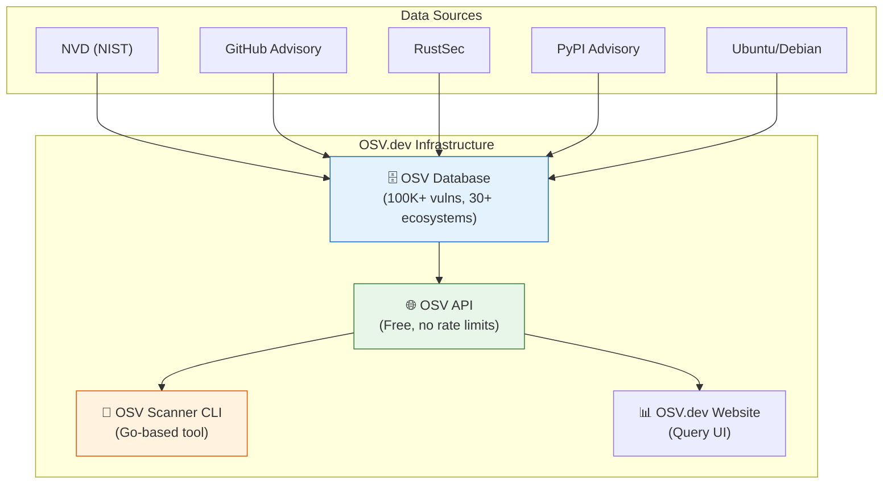
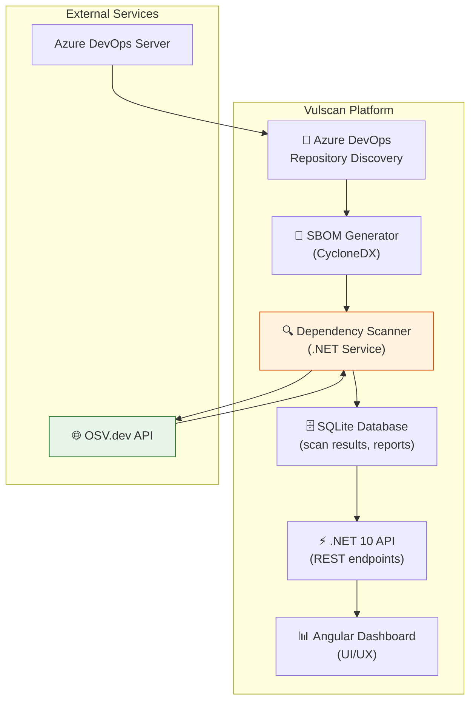
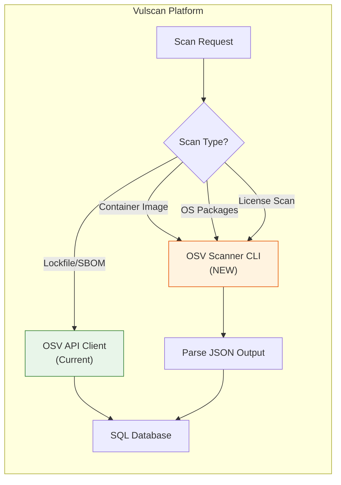

# 🔍 OSV.dev vs Vulscan: Comparison & Integration Strategy

**Date:** May 1, 2026  
**Project:** Vulscan — Azure DevOps Vulnerability Scanning Platform  
**Reference:** [Google OSV.dev](https://github.com/google/osv.dev) | [OSV Scanner](https://github.com/google/osv-scanner)

---

## 📋 Executive Summary

**Google OSV.dev** is the **infrastructure** (database + API + scanner) that powers vulnerability detection across 30+ ecosystems.  
**Vulscan** is an **enterprise platform** built on top of OSV.dev API, tailored for Azure DevOps on-premises environments with dashboard, reporting, and workflow management.

### Current Status: ✅ **We're Already Using OSV.dev API Correctly**

Our implementation in [`DependencyScanner.cs`](../server/src/Vulscan.Infrastructure/Services/DependencyScanner.cs) and [`OsvApiClient.cs`](../server/src/Vulscan.Infrastructure/Clients/OsvApiClient.cs) already integrates with OSV.dev API. This is the **recommended approach** for ecosystem-aware vulnerability scanning.

---

## 🏗️ Architecture Comparison

### Google OSV.dev Ecosystem



### Vulscan Platform Architecture



---

## ⚖️ Feature Comparison Matrix

| Feature | OSV Scanner (CLI) | Vulscan (Platform) | Status |
|---------|-------------------|---------------------|---------|
| **Scanning Capabilities** |
| Lockfile scanning (npm, NuGet) | ✅ 19+ lockfile types | ✅ npm, NuGet | ✅ Implemented |
| SBOM scanning (CycloneDX/SPDX) | ✅ Both formats | ✅ CycloneDX generation | ✅ Implemented |
| Container image scanning | ✅ Layer-aware | ❌ Not supported | 🔴 **Missing** |
| OS package scanning (Debian, Ubuntu) | ✅ Supported | ❌ Not supported | 🔴 **Missing** |
| Git commit scanning | ✅ Supported | ❌ Not supported | 🔴 **Missing** |
| C/C++ vendored code detection | ✅ Supported | ❌ Not supported | 🔴 **Missing** |
| Call analysis (reduce false positives) | ✅ Experimental | ❌ Not supported | 🔴 **Missing** |
| Offline mode (air-gapped) | ✅ Supported | ❌ Requires internet | 🔴 **Missing** |
| **Vulnerability Data** |
| OSV.dev API integration | ✅ Native | ✅ **Implemented** | ✅ Implemented |
| Real-time CVE data | ✅ Yes | ✅ Yes | ✅ Implemented |
| Multi-source aggregation | ✅ Yes (via OSV) | ✅ Yes (via OSV) | ✅ Implemented |
| Caching | ✅ Local cache | ✅ In-memory cache | ✅ Implemented |
| **Remediation** |
| Guided remediation | ✅ Experimental | ❌ Not supported | 🔴 **Missing** |
| Dependency upgrade suggestions | ✅ Interactive mode | ⚠️ Manual via reports | 🟡 **Partial** |
| **Enterprise Features** |
| Azure DevOps integration | ❌ Generic Git only | ✅ **Native PAT/Basic Auth** | ✅ **Vulscan Advantage** |
| Web dashboard | ❌ CLI only | ✅ **Angular SPA** | ✅ **Vulscan Advantage** |
| Historical reporting | ❌ Per-scan only | ✅ **Trend analysis** | ✅ **Vulscan Advantage** |
| Scheduled scanning | ❌ Manual/CI only | ✅ **Background workers** | ✅ **Vulscan Advantage** |
| Multi-project management | ❌ One-off scans | ✅ **Instance/Project hierarchy** | ✅ **Vulscan Advantage** |
| Authentication & RBAC | ❌ No auth | ✅ **JWT + Role-based** | ✅ **Vulscan Advantage** |
| Notifications (Email/Teams) | ❌ No notifications | ✅ **SMTP + Webhooks** | ✅ **Vulscan Advantage** |
| **Licensing** |
| License scanning | ✅ deps.dev integration | ❌ Not supported | 🔴 **Missing** |
| License compliance checks | ✅ Allowed list | ❌ Not supported | 🔴 **Missing** |
| **Deployment** |
| Installation complexity | Low (single binary) | Medium (full stack) | - |
| Platform support | Windows, Linux, macOS | Windows Server (recommended) | - |
| Resource requirements | Minimal | Moderate (DB + API + UI) | - |

---

## 🔴 What's Missing in Vulscan (Gap Analysis)

### Critical Gaps

1. **Container Image Scanning** 🐳
   - **Impact:** High
   - **OSV Scanner Feature:** Layer-aware container scanning for Alpine, Debian, Ubuntu
   - **Use Case:** Scan Docker images used in CI/CD pipelines
   - **Recommendation:** Integrate OSV Scanner CLI for container scans

2. **OS Package Vulnerabilities** 🐧
   - **Impact:** High
   - **OSV Scanner Feature:** Detects vulnerabilities in system packages
   - **Use Case:** Scan VMs, base images, production servers
   - **Recommendation:** Add OS package detection via OSV Scanner

3. **Call Analysis** 🎯
   - **Impact:** Medium
   - **OSV Scanner Feature:** Determines if vulnerable functions are actually called
   - **Use Case:** Reduce false positives, prioritize real threats
   - **Recommendation:** Consider integrating in Phase 2

### Important Gaps

1. **Guided Remediation** 🛠️
   - **Impact:** Medium
   - **OSV Scanner Feature:** Interactive upgrade suggestions with ROI analysis
   - **Use Case:** Help developers fix vulnerabilities efficiently
   - **Recommendation:** Build custom remediation UI in dashboard

2. **License Scanning** 📜
   - **Impact:** Medium
   - **OSV Scanner Feature:** License compliance checking via deps.dev
   - **Use Case:** Ensure legal compliance, avoid GPL contamination
   - **Recommendation:** Add license tracking to SBOM

3. **Offline Mode** 🔌
   - **Impact:** Low (for on-prem)
   - **OSV Scanner Feature:** Pre-downloaded vulnerability database
   - **Use Case:** Air-gapped environments, faster scans
   - **Recommendation:** Add as optional deployment mode

### Nice-to-Have Gaps

1. **Extended Ecosystem Support**
   - **Current:** npm, NuGet
   - **OSV Scanner:** Maven, PyPI, Go modules, Cargo, Gem, Composer, etc.
   - **Recommendation:** Prioritize based on customer demand (Java/Maven likely next)

2. **C/C++ Vendored Code Detection**
   - **Impact:** Low (Azure DevOps primarily .NET/Node)
   - **Recommendation:** Skip unless customer requests

---

## 💡 Integration Strategies

### ✅ Strategy 1: Continue Using OSV API (Current — **RECOMMENDED**)

**Status:** ✅ **Already Implemented**

**What We're Doing:**

- Direct API integration via [`OsvApiClient.cs`](../server/src/Vulscan.Infrastructure/Clients/OsvApiClient.cs)
- Batch queries for efficient scanning
- In-memory caching for performance
- Supports npm and NuGet ecosystems

**Pros:**

- ✅ No external dependencies
- ✅ Complete control over logic
- ✅ Integrated with our platform
- ✅ Free, no rate limits
- ✅ Already working well

**Cons:**

- ⚠️ We have to implement new features ourselves
- ⚠️ Missing advanced features (container scanning, call analysis)

**Recommendation:** **KEEP THIS APPROACH** for lockfile/SBOM scanning.

---

### 🆕 Strategy 2: Hybrid Approach — Add OSV Scanner for Advanced Features

**Proposal:** Use OSV Scanner CLI as a **secondary scanning engine** for features we don't have.

#### Implementation Plan



#### Step-by-Step Integration

**Phase 1: Add OSV Scanner CLI Support**

1. **Install OSV Scanner** as a system dependency

   ```bash
   # Download latest release
   wget https://github.com/google/osv-scanner/releases/download/v2.3.6/osv-scanner_linux_amd64
   chmod +x osv-scanner_linux_amd64
   mv osv-scanner_linux_amd64 /usr/local/bin/osv-scanner
   ```

2. **Create a new service** `/server/src/Vulscan.Infrastructure/Services/OsvScannerService.cs`:

   ```csharp
   public interface IOsvScannerService
   {
       Task<ContainerScanResult> ScanContainerImageAsync(
           string imageName, CancellationToken ct);
       
       Task<LicenseScanResult> ScanLicensesAsync(
           string repoPath, CancellationToken ct);
   }
   
   public class OsvScannerService : IOsvScannerService
   {
       public async Task<ContainerScanResult> ScanContainerImageAsync(
           string imageName, CancellationToken ct)
       {
           // Execute: osv-scanner scan image <image-name> --format json
           var process = new Process
           {
               StartInfo = new ProcessStartInfo
               {
                   FileName = "osv-scanner",
                   Arguments = $"scan image {imageName} --format json",
                   RedirectStandardOutput = true,
                   UseShellExecute = false
               }
           };
           
           process.Start();
           var json = await process.StandardOutput.ReadToEndAsync(ct);
           await process.WaitForExitAsync(ct);
           
           // Parse JSON output
           return ParseContainerScanResult(json);
       }
   }
   ```

3. **Add new controllers**:
   - `ContainerScansController.cs` — for Docker image scanning
   - `LicenseScansController.cs` — for license compliance

4. **Extend database schema**:

   ```sql
   CREATE TABLE ContainerScans (
       Id UNIQUEIDENTIFIER PRIMARY KEY,
       ImageName NVARCHAR(500),
       ImageTag NVARCHAR(100),
       ScanDate DATETIME2,
       BaseImageVulns INT,
       PackageVulns INT,
       TotalVulns INT
   );
   
   CREATE TABLE LicenseFindings (
       Id UNIQUEIDENTIFIER PRIMARY KEY,
       ScanRunId UNIQUEIDENTIFIER,
       PackageName NVARCHAR(255),
       PackageVersion NVARCHAR(100),
       LicenseType NVARCHAR(100),
       IsAllowed BIT
   );
   ```

**Phase 2: Add License Scanning**

1. Integrate OSV Scanner's `--licenses` flag
2. Add license compliance rules (allowed/denied list)
3. Build UI for license reports in Angular dashboard

**Phase 3: Add Call Analysis (Optional)**

1. Enable experimental call analysis in OSV Scanner
2. Parse reachability data
3. Add "Exploitable" vs "Not Reachable" tags in UI

---

### 🚫 Strategy 3: Replace OSV API with OSV Scanner CLI (NOT RECOMMENDED)

**Reasoning:**

- ❌ OSV Scanner is slower (spawns processes)
- ❌ Loses batch query efficiency
- ❌ No benefit for our core use case
- ❌ Adds unnecessary complexity

**Verdict:** Keep OSV API client for lockfile scanning.

---

## 📊 Recommended Roadmap

### 🎯 Phase 1: Immediate (Q2 2026)

**Focus:** Fill critical gaps with minimal effort

| Task | Effort | Impact | Priority |
|------|--------|--------|----------|
| Install OSV Scanner CLI on server | 2 hours | Low | P2 |
| Add container image scanning service | 1 week | High | P0 |
| Extend database for container scans | 2 days | High | P0 |
| Add container scan UI to dashboard | 1 week | High | P0 |
| Document OSV Scanner integration | 1 day | Medium | P1 |

**Deliverable:** Basic container scanning capability

---

### 🎯 Phase 2: Short-term (Q3 2026)

**Focus:** Add license compliance & OS package scanning

| Task | Effort | Impact | Priority |
|------|--------|--------|----------|
| Add license scanning via OSV Scanner | 1 week | Medium | P1 |
| Build license compliance rules engine | 1 week | Medium | P1 |
| Add OS package vulnerability detection | 2 weeks | High | P0 |
| Add license dashboard tab | 1 week | Medium | P1 |

**Deliverable:** License compliance reporting + OS package scanning

---

### 🎯 Phase 3: Long-term (Q4 2026)

**Focus:** Advanced features & optimization

| Task | Effort | Impact | Priority |
|------|--------|--------|----------|
| Integrate call analysis (reachability) | 2 weeks | Medium | P1 |
| Add offline mode (OSV DB download) | 1 week | Low | P2 |
| Build guided remediation UI | 3 weeks | High | P0 |
| Add support for Maven/PyPI ecosystems | 2 weeks | Medium | P1 |

**Deliverable:** Enterprise-grade vulnerability platform

---

## 🏆 Competitive Advantages We Keep

### Where Vulscan Beats OSV Scanner

1. **Azure DevOps Native Integration** 🏢
   - Deep integration with PAT/Basic Auth
   - Instance/Project/Repository hierarchy
   - Automated discovery and scheduled scanning

2. **Enterprise Dashboard** 📊
   - Executive summary reports
   - Historical trend analysis
   - Drill-down by project/CVE/severity
   - Export to CSV for compliance audits

3. **Workflow Management** ⚙️
   - Background workers for autonomous scanning
   - Email & Teams notifications
   - Configurable scan schedules
   - Status tracking (New → Confirmed → Fixed)

4. **Multi-Tenancy** 🏗️
   - Support multiple Azure DevOps instances
   - Role-based access control (Admin/User)
   - Per-instance configuration

5. **Persistence & History** 💾
   - All scan results stored in SQL
   - Compare scans over time
   - Audit trail for compliance

---

## 🎯 Final Recommendations

### ✅ What We Should Do

1. **KEEP using OSV.dev API** for lockfile/SBOM scanning (current implementation is excellent)
2. **ADD OSV Scanner CLI** as a secondary engine for:
   - Container image scanning (**Priority 0**)
   - OS package scanning (**Priority 0**)
   - License compliance (**Priority 1**)
3. **Enhance our dashboard** with guided remediation UI (custom, better than CLI)
4. **Expand ecosystem support** to Maven/PyPI based on customer demand

### ❌ What We Should NOT Do

1. ❌ Replace OSV API client with CLI (no benefit)
2. ❌ Rewrite scanning logic (OSV.dev does it better)
3. ❌ Build our own vulnerability database (use OSV.dev)

### 🎓 Key Takeaway

**Google OSV.dev is not a competitor — it's our foundation.**

We're building an **enterprise vulnerability management platform** on top of OSV.dev infrastructure. Our value-add is:

- Azure DevOps integration
- Enterprise workflow & reporting
- Historical analysis & compliance
- Multi-tenancy & RBAC

By adding OSV Scanner CLI for advanced features (containers, licenses), we get the **best of both worlds**.

---

## 📚 References

- [OSV.dev Official Site](https://osv.dev/)
- [OSV.dev Documentation](https://google.github.io/osv.dev/)
- [OSV Scanner GitHub](https://github.com/google/osv-scanner)
- [OSV Scanner Documentation](https://google.github.io/osv-scanner/)
- [OSV API Reference](https://google.github.io/osv.dev/api/)
- [Our CVE Integration Guide](./CVE_INTEGRATION_GUIDE.md)
- [Our DependencyScanner Implementation](../server/src/Vulscan.Infrastructure/Services/DependencyScanner.cs)

---

**Document Version:** 1.0  
**Last Updated:** May 1, 2026  
**Author:** Vulscan Engineering Team
